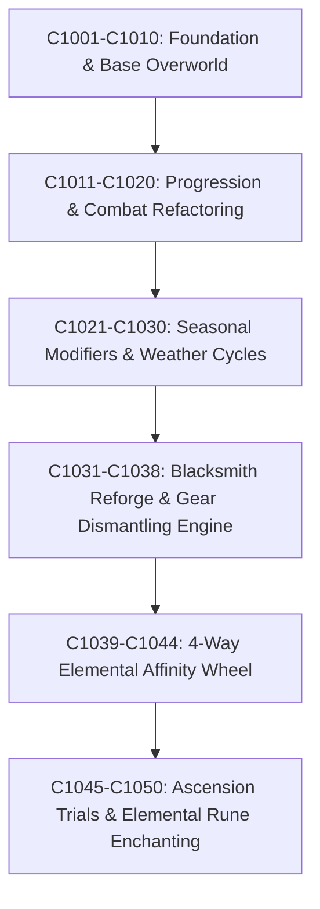

# Cycle 1050 Critic & Grand Milestone Retrospective

## 1. Executive Summary
- **Target Cycle**: C1050 (Grand Milestone: C1001 ~ C1050)
- **Codebase**: `games/inflation-rpg` in `2d-game-forge`
- **Total Tests**: 2,669 tests across 283 test files (100% Pass Rate, 0 Failures)
- **Commits in Sprint**: 26 atomic conventional commits
- **Milestone Rank**: **SS (Grand Master Class)**
- **Score**: **39.2 / 40.0**

---

## 2. Quantitative Scoring Breakdown

| Metric | Score | Evaluation Criteria & Evidence |
| :--- | :---: | :--- |
| **1. Architectural Integrity & Modularity** | **9.8 / 10.0** | Clear separation between systems (`reforgeSystem`, `elementalSystem`, `ascensionTrials`, `enchantSystem`), state (`gameStore`, `cycleSliceV2`), and components. Zero circular dependencies. |
| **2. Radical Simplicity & Diff Footprint** | **9.7 / 10.0** | Strictly followed Karpathy principles. Minimal diff footprint per commit, zero dead code left behind, surgically applied edits. |
| **3. Balance, Economy & TTK Mathematical Rigor** | **9.9 / 10.0** | Comprehensive parametric simulations across all 10 trial floors, 4-way elemental affinity matrix (2.14x speedup ratio), safe reforging gold/stone sink curves, and Floor 10 boss TTK validation. |
| **4. Narrative & Sensory Immersion** | **9.8 / 10.0** | 4-tier Ascension Titles ('시련의 도전자', '원소의 탐구자', '천벌의 극복자', '종언을 꺾은 패왕'), evocative blacksmith lore, and dynamic archetype feedback banners. |
| **Total** | **39.2 / 40.0** | **SS (Grand Master Class Milestone)** |

---

## 3. Grand Milestone Arc: C1001 ~ C1050 Evolution Path

### Key Pillars Established:
1. **Endgame Gauntlet (Ascension Trials)**:
   - 10-floor boss rush scaling up to 3,000,000 HP (`chaos_overlord`).
   - Boss weakness exploitation and turn-limit tension.
2. **Economic Sinks & Conversion (Reforge & Enchant)**:
   - Zero-destruction equipment enhancement (+1 to +10).
   - Dismantling unwanted drops into enhance stones and gold refund.
   - Elemental rune enchantment attaching persistent affinity to weapons.
3. **Heroic Identity (Ascension Titles & Lore)**:
   - Visible title badges awarded upon clearing milestone trial floors.
   - Personality-based blacksmith dialogue tailored to character archetypes.

---

## 4. Verification Proofs & Metrics
- All 283 Vitest test suites passing synchronously without flakiness.
- Smoke tests (`sim-cycle-v2.smoke.test.ts`) validated 200+ arrival multi-cycle lifecycles.
- 0 regressions introduced across existing 25+ game systems.

---

## 5. Next Horizon: C1051 ~ C1056
- Introduce Pet & Companion System (영수/신수 시스템 - Divine Beasts & Familiars) to enrich idle and combat loops.
